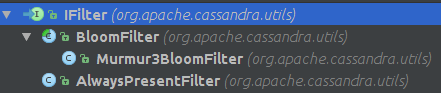
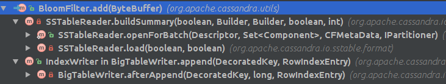
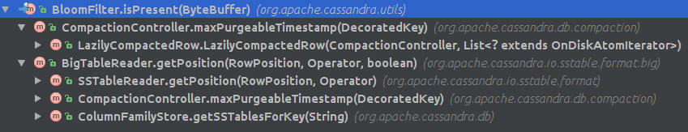
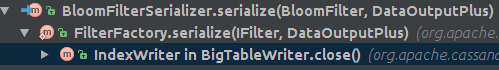
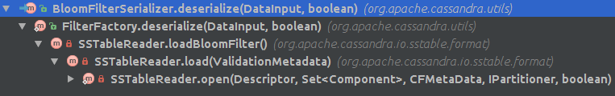

# Bloom Filter实现



## 创建BloomFilter
根据CFMetaData中的bloomFilterFpChance和Key的个数，计算出`BloomSpecification`从而创建BloomFilter． FilterFactory创建BloomFilter, 对于OffHeap内存的创建，修改, 获取，参考OffHeap一节

 ```java
 public static class BloomSpecification
 {
      final int K; // number of hash functions.
      final int bucketsPerElement;
 }

 public static IFilter getFilter(long numElements, double maxFalsePosProbability, boolean offheap)
 {
      int bucketsPerElement = BloomCalculations.maxBucketsPerElement(numElements);
      BloomCalculations.BloomSpecification spec = BloomCalculations.computeBloomSpec(bucketsPerE  lement, maxFalsePosProbability);
      return createFilter(spec.K, numElements, spec.bucketsPerElement, offheap);
 }

 private static IFilter createFilter(int hash, long numElements, int bucketsPer, boolean offheap)
 {
     long numBits = (numElements * bucketsPer) + BITSET_EXCESS;
     IBitSet bitset = offheap ? new OffHeapBitSet(numBits) : new OpenBitSet(numBits);
     return new Murmur3BloomFilter(hash, bitset);
 }
 ```
 ## 对每个Key计算hash值，存入OffHeapBitSet.

 

　1.　在创建IndexSummary时，Filter.db不存在时<br/>
　2.　在往Cassandra写入数据时．

 ```java
 public void add(ByteBuffer key)
 {
      long[] indexes = indexes(key);
      for (int i = 0; i < hashCount; i++)
      {
          bitset.set(indexes[i]);
      }
 }

 // note that this method uses the threadLocal that may be longer than hashCount
 // to avoid generating a lot of garbage since stack allocation currently does not support stores
 // (CASSANDRA-6609). it returns the array so that the caller does not need to perform
 // a second threadlocal lookup.
 private long[] indexes(ByteBuffer key)
  {
       long[] indexes = reusableIndexes.get();
       hash(key, key.position(), key.remaining(), 0L, indexes);
       setIndexes(indexes[0], indexes[1], hashCount, bitset.capacity(), indexes);
       return indexes;
  }

  private void setIndexes(long base, long inc, int count, long max, long[] results)
  {
      for (int i = 0; i < count; i++)
      {
          results[i] = FBUtilities.abs(base % max);
          base += inc;
      }
  }
  ```
## 查询时对BloomFilter的使用

　

 ```java
 public final boolean isPresent(ByteBuffer key)
 {
     long[] indexes = indexes(key);
     for (int i = 0; i < hashCount; i++)
     {
         if (!bitset.get(indexes[i]))
         {
             return false;
         }
     }
     return true;
 }
```
## 对Filter.db的存取


从图中可以看到对Filter.db的存储是在每个SStable关闭的时候



在打开每个SStable的时候，Filter.db存在，CFMetaData中的bloomFilterFPChance没有改变，就会load Filter.db到BloomFilter.


