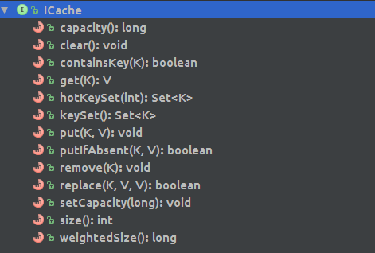
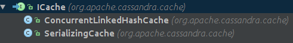

# Cassandra Cache
## Cache初始化
Cache由三种类型，KeyCache，RowCache，CounterCache, 默认KeyCache开启, 类结构图


Cache接口和Map接口类似, 增加capacity显示容量, 在put和remove时不返回Value, 避免在SerializingCache中deserialize在offheap的Value数据．



###KeyCache 和 CounterCache 初始化
KeyCache 和 CounterCache的代码类似，此只列出KeyCache
```java
private AutoSavingCache<KeyCacheKey, RowIndexEntry> initKeyCache()
{
    long keyCacheInMemoryCapacity = DatabaseDescriptor.getKeyCacheSizeInMB() * 1024 * 1024;
    ICache<KeyCacheKey, RowIndexEntry> kc = ConcurrentLinkedHashCache.create(keyCacheInMemoryCapacity);
    AutoSavingCache<KeyCacheKey, RowIndexEntry> keyCache = new AutoSavingCache<>(
                                                           kc,
                                                           CacheType.KEY_CACHE,
                                                           new KeyCacheSerializer());
    int keyCacheKeysToSave = DatabaseDescriptor.getKeyCacheKeysToSave();
    keyCache.scheduleSaving(DatabaseDescriptor.getKeyCacheSavePeriod(), keyCacheKeysToSave);
    return keyCache;
}
```
ConcurrentLinkedHashCache的创建
```java
public static ConcurrentLinkedHashCache<K, V> create(long weightedCapacity)
{
    EntryWeigher<K, V> entryWeigher = new EntryWeigher<K, V>()
    {
        public int weightOf(K key, V value)
        {
            long size = key.unsharedHeapSize() + value.unsharedHeapSize();
            return (int) size;
        }
    };
    ConcurrentLinkedHashMap<K, V> map = new ConcurrentLinkedHashMap.Builder<K, V>()
                                        .weigher(entryWeigher)
                                        .maximumWeightedCapacity(weightedCapacity)
                                        .concurrencyLevel(DEFAULT_CONCURENCY_LEVEL)
                                        .build();
    return new ConcurrentLinkedHashCache<>(map);
}
```

###RowCache 初始化
RowCache初始化唯一的不同就是Cache的实现换成SerializingCache
```java
ICache<RowCacheKey, IRowCacheEntry> rc = new SerializingCacheProvider().create(rowCacheInMemoryCapacity);

public ICache<RowCacheKey, IRowCacheEntry> create(long capacity)
{
    return SerializingCache.create(capacity, new RowCacheSerializer());
}

public static <K, V> SerializingCache<K, V> create(long weightedCapacity, ISerializer<V> serializer)
{
    Weigher<RefCountedMemory> weigher = new Weigher<RefCountedMemory>()
    {
        public int weightOf(RefCountedMemory value)
        {
            long size = value.size();
            return (int) size;
        }
    };
    return new SerializingCache<>(weightedCapacity, weigher, serializer);
}

private SerializingCache(long capacity, Weigher<RefCountedMemory> weigher, ISerializer<V> serializer)
{
    this.serializer = serializer;
    EvictionListener<K,RefCountedMemory> listener = new EvictionListener<K, RefCountedMemory>()
    {
        public void onEviction(K k, RefCountedMemory mem)
        {
            mem.unreference();
        }
    };
    this.map = new ConcurrentLinkedHashMap.Builder<K, RefCountedMemory>()
               .weigher(weigher)
               .maximumWeightedCapacity(capacity)
               .concurrencyLevel(DEFAULT_CONCURENCY_LEVEL)
               .listener(listener)
               .build();
}
```

#Cache使用


