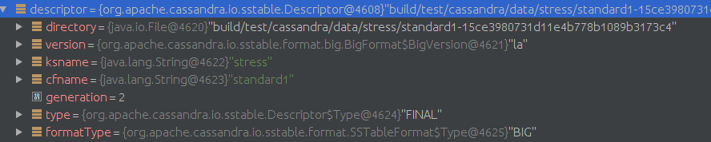
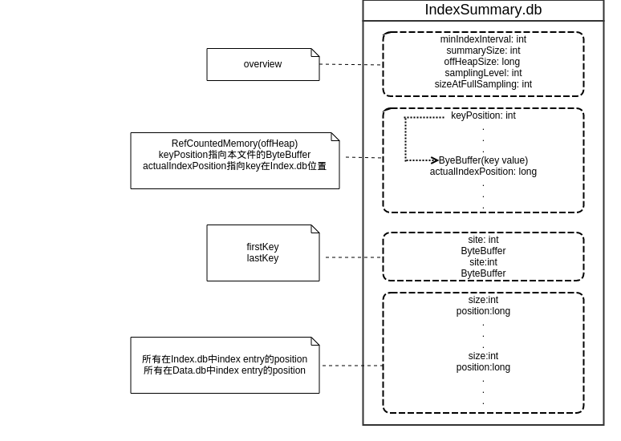

# 创建ColumnFamilyStore
## 创建DataTracker

```java
//Memtable类
class Memtable{
  MemtableAllocator allocator;
  //the write barrier for directing writes to this memtable during a switch
  volatile OpOrder.Barrier writeBarrier;
  ColumnFamilyStore cfs;
  AtomicLong liveDataSize = new AtomicLong(0);
  AtomicLong currentOperations = new AtomicLong(0);
  // We index the memtable by RowPosition only for the purpose of being able
  // to select key range using Token.KeyBound. However put() ensures that we
  // actually only store DecoratedKey.
  ConcurrentNavigableMap<RowPosition, AtomicBTreeColumns> rows = new ConcurrentSkipListMap<>();
  CellNameType initialComparator;
  // the last ReplayPosition owned by this Memtable; all ReplayPositions lower are owned by this or an earlier Memtable
  AtomicReference<ReplayPosition> lastReplayPosition;
  // the "first" ReplayPosition owned by this Memtable;
  // this is inaccurate, and only used as a convenience to prevent CLSM flushing wantonly
  ReplayPosition minReplayPosition = CommitLog.instance.getContext();
  public Memtable(ColumnFamilyStore cfs){
    this.cfs = cfs;
    this.allocator = MEMORY_POOL.newAllocator();
    this.initialComparator = cfs.metadata.comparator;
    this.cfs.scheduleFlush();
  }
}

/**
 * An immutable structure holding the current memtable, the memtables pending
 * flush, the sstables for a column family, and the sstables that are active
 * in compaction (a subset of the sstables).
 */
public static class View
{
    /**
     * ordinarily a list of size 1, but when preparing to flush will contain both the memtable we will flush
     * and the new replacement memtable, until all outstanding write operations on the old table complete.
     * The last item in the list is always the "current" memtable.
     */
    private final List<Memtable> liveMemtables;
   　/**
　    * contains all memtables that are no longer referenced for writing and are queued for / in the process of being
      * flushed. In chronologically ascending order.
  　  */
      private final List<Memtable> flushingMemtables;
      public final Set<SSTableReader> compacting;
      public final Set<SSTableReader> sstables;
      public final SSTableIntervalTree intervalTree;

      View(List<Memtable> liveMemtables, List<Memtable> flushingMemtables, Set<SSTableReader> sstables, Set<SSTableReader> compacting, SSTableIntervalTree intervalTree){
          this.liveMemtables = liveMemtables;
          this.flushingMemtables = flushingMemtables;
          this.sstables = sstables;
          this.compacting = compacting;
          this.intervalTree = intervalTree;
      }
｝

//DataTracker构造函数
public DataTracker(ColumnFamilyStore cfstore){
    this.cfstore = cfstore;
    this.view = new AtomicReference<>();
    this.init();
}

void init()
{
    view.set(new View(
            ImmutableList.of(new Memtable(cfstore)),
            ImmutableList.<Memtable>of(),
            Collections.<SSTableReader>emptySet(),
            Collections.<SSTableReader>emptySet(),
            SSTableIntervalTree.empty()));
}
```

## 初始化SSTableReader
1. 从Statistics.db文件读取validation和stats信息.
2. 检查validation数据.
3. 通过internalOpen函数找到BigTableReader, 执行其构造函数, 实际调用SSTableReader的构造函数.
4. 装载index和filter.
5. 对SSTableReader做validate.

 从Directories中得到数据文件，按照`Set<Map.Entry<Descriptor, Set<Component>>>`存放, 对每个Descriptor对应的Set<Component>打开一个线程来创建SStableReader.

 Descriptor结构

 

 数据文件类型

 

 ```java
 private static SSTableReader open(Descriptor descriptor,
                                      Set<Component> components,
                                      CFMetaData metadata,
                                      IPartitioner partitioner,
                                      boolean validate) throws IOException{
      //从Statistics.db中读取validation和stats信息
      Map<MetadataType, MetadataComponent> sstableMetadata = descriptor.getMetadataSerializer().deserialize(descriptor,
                EnumSet.of(MetadataType.VALIDATION, MetadataType.STATS));
      ValidationMetadata validationMetadata = (ValidationMetadata) sstableMetadata.get(MetadataType.VALIDATION);
        StatsMetadata statsMetadata = (StatsMetadata) sstableMetadata.get(MetadataType.STATS);
      // Check if sstable is created using same partitioner.
      // Partitioner can be null, which indicates older version of sstable or no stats available.
      // In that case, we skip the check.
      String partitionerName = partitioner.getClass().getCanonicalName();
      if (validationMetadata != null && !partitionerName.equals(validationMetadata.partitioner)){
            System.exit(1);
      }
      SSTableReader sstable = internalOpen(descriptor, components, metadata, partitioner, System.currentTimeMillis(), statsMetadata, OpenReason.NORMAL);
      // load index and filter
      long start = System.nanoTime();
      sstable.load(validationMetadata);
      if (validate)
          sstable.validate();
      return sstable;
  }
 ```

###SSTableRead构造函数
1. 创建SSTableDeletingTask.
2. 从system.sstable_activity中得到RestorableMeter, 创建ReadMeterSyncTask, 每隔5分钟执行以此更新操作.
 ```java
 protected SSTableReader(final Descriptor desc,
                            Set<Component> components,
                            CFMetaData metadata,
                            IPartitioner partitioner,
                            long maxDataAge,
                            StatsMetadata sstableMetadata,
                            OpenReason openReason)
 {
     this.rowIndexEntrySerializer = descriptor.version.getSSTableFormat().getIndexSerializer(metadata);
     deletingTask = new SSTableDeletingTask(this);
     readMeter = SystemKeyspace.getSSTableReadMeter(desc.ksname, desc.cfname, desc.generation);
     // sync the average read rate to system.sstable_activity every five minutes, starting one minute from now
     readMeterSyncFuture = syncExecutor.scheduleAtFixedRate(new Runnable()
     {
         public void run()
         {
             if (!isCompacted.get())
             {
                 meterSyncThrottle.acquire();
                 SystemKeyspace.persistSSTableReadMeter(desc.ksname, desc.cfname, desc.generation, readMeter);
             }
         }
     }, 1, 5, TimeUnit.MINUTES);
 ```

###装载index和filter
1. 从Summary.db读取IndexSumary, 将index entry 和 data entry的position分别读到ifile和dfile.
2. 如果Summary.db load失败, 创建IndexSummary.
3. 把创建的IndexSummary保存到Summary.db

 ```java
 /**
  * Loads ifile, dfile and indexSummary, and optionally recreates the bloom filter.
  * @param saveSummaryIfCreated for bulk loading purposes, if the summary was absent and needed to be built, you can avoid persisting it to disk by setting this to false
  */
  private void load(boolean recreateBloomFilter, boolean saveSummaryIfCreated) throws IOException
  {
      SegmentedFile.Builder ibuilder = SegmentedFile.getBuilder(DatabaseDescriptor.getIndexAccessMode());
      SegmentedFile.Builder dbuilder = compression
                ? SegmentedFile.getCompressedBuilder()
                : SegmentedFile.getBuilder(DatabaseDescriptor.getDiskAccessMode());
      boolean summaryLoaded = loadSummary(ibuilder, dbuilder);
      if (recreateBloomFilter || !summaryLoaded)
          buildSummary(recreateBloomFilter, ibuilder, dbuilder, summaryLoaded, Downsampling.BASE_SAMPLING_LEVEL);
        ifile = ibuilder.complete(descriptor.filenameFor(Component.PRIMARY_INDEX));
        dfile = dbuilder.complete(descriptor.filenameFor(Component.DATA));
        if (saveSummaryIfCreated && (recreateBloomFilter || !summaryLoaded))
            // save summary information to disk
            saveSummary(ibuilder, dbuilder);
    }
 ```

###IndexSumary 结构与解释

 

 Layout of Memory for index summaries:
 1. A **header** containing the offset into **bytes** of entries in the index summary data, consisting of one four byte position for each entry in the summary.  This allows us do simple math in getIndex() to find the position in the Memory to start reading the actual index summary entry.  (This is necessary because keys can have different lengths.)
 2.  A sequence of (DecoratedKey, position) pairs, where position is the offset into the actual index file.

 `RefCountedMemory` 将index key 和 index position(指向Index.db的位置)存储在offheap

 

####装载IndexSummary
 ```java
 //Load index summary from Summary.db file if it exists.
 //if loaded index summary has different index interval from current value stored in schema,
 //then Summary.db file will be deleted and this returns false to rebuild summary.
 public boolean loadSummary(SegmentedFile.Builder ibuilder, SegmentedFile.Builder dbuilder){
     File summariesFile = new File(descriptor.filenameFor(Component.SUMMARY));
     DataInputStream iStream = new DataInputStream(new FileInputStream(summariesFile));
     indexSummary = IndexSummary.serializer.deserialize(iStream, partitioner, descriptor.version.hasSamplingLevel(), metadata.getMinIndexInterval(), metadata.getMaxIndexInterval());
     first = partitioner.decorateKey(ByteBufferUtil.readWithLength(iStream));
     last = partitioner.decorateKey(ByteBufferUtil.readWithLength(iStream));
     ibuilder.deserializeBounds(iStream);
     dbuilder.deserializeBounds(iStream);
 }
 ```
####创建IndexSummary
 ```java
 //Build index summary(and optionally bloom filter) by reading through Index.db file.
 private void buildSummary(boolean recreateBloomFilter, SegmentedFile.Builder ibuilder, SegmentedFile.Builder dbuilder, boolean summaryLoaded, int samplingLevel) throws IOException{
    // we read the positions in a BRAF
    //so we don't have to worry about an entry spanning a mmap boundary.
    RandomAccessReader primaryIndex = RandomAccessReader.open(new File(descriptor.filenameFor(Component.PRIMARY_INDEX)));
    try
    {
        long indexSize = primaryIndex.length();
        long histogramCount = sstableMetadata.estimatedRowSize.count();
        long estimatedKeys = histogramCount > 0 && !sstableMetadata.estimatedRowSize.isOverflowed()
                ? histogramCount
                : estimateRowsFromIndex(primaryIndex);
        if (recreateBloomFilter)
            //创建bloom filter
            bf = FilterFactory.getFilter(estimatedKeys, metadata.getBloomFilterFpChance(), true);
        IndexSummaryBuilder summaryBuilder = null;
        if (!summaryLoaded)
            summaryBuilder = new IndexSummaryBuilder(estimatedKeys, metadata.getMinIndexInterval(), samplingLevel);
        long indexPosition;
        RowIndexEntry.IndexSerializer rowIndexSerializer = descriptor.getFormat().getIndexSerializer(metadata);
        while ((indexPosition = primaryIndex.getFilePointer()) != indexSize)
        {
            ByteBuffer key = ByteBufferUtil.readWithShortLength(primaryIndex);
            //顺序读取每个RowIndexEntry
            RowIndexEntry indexEntry = rowIndexSerializer.deserialize(primaryIndex, descriptor.version);
            DecoratedKey decoratedKey = partitioner.decorateKey(key);
            if (first == null)
                first = decoratedKey;
            last = decoratedKey;
            if (recreateBloomFilter)
                //加入bloom filter
                bf.add(decoratedKey.getKey());
            // if summary was already read from disk we don't want to re-populate it using primary index
            if (!summaryLoaded)
            {
                //按照minIndexInterval间隔存放index key, 这些key在IndexSummary存放在offheap
                summaryBuilder.maybeAddEntry(decoratedKey, indexPosition);
                ibuilder.addPotentialBoundary(indexPosition);
                //position就是RowIndex指向Data.db的位置, Entry的开始位置
                dbuilder.addPotentialBoundary(indexEntry.position);
            }
        }
        if (!summaryLoaded)
            indexSummary = summaryBuilder.build(partitioner);
    }finally{
        FileUtils.closeQuietly(primaryIndex);
    }
    first = getMinimalKey(first);
    last = getMinimalKey(last);
 }

 //IndexSummaryBuilder中的maybeAddEntry, //TODO startPoints作用
 public IndexSummaryBuilder maybeAddEntry(DecoratedKey decoratedKey, long indexPosition)
 {
    if (keysWritten % minIndexInterval == 0)
    {
        // see if we should skip this key based on our sampling level
        boolean shouldSkip = false;
        for (int start : startPoints)
        {
            if ((indexIntervalMatches - start) % BASE_SAMPLING_LEVEL == 0)
            {
                shouldSkip = true;
                break;
            }
        }
        if (!shouldSkip)
        {
            keys.add(getMinimalKey(decoratedKey));
            //加入offheap
            offheapSize += decoratedKey.getKey().remaining();
            positions.add(indexPosition);
            //加入offheap
            offheapSize += TypeSizes.NATIVE.sizeof(indexPosition);
        }
        indexIntervalMatches++;
    }
    keysWritten++;
    return this;
 }
 ```
